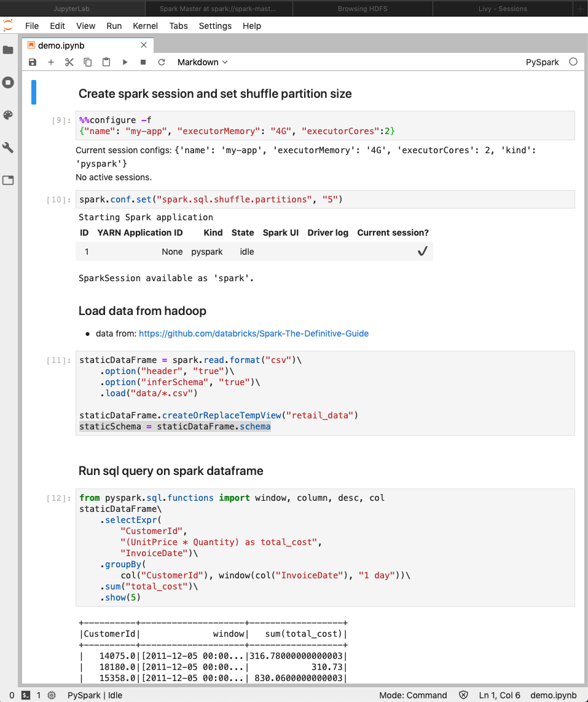
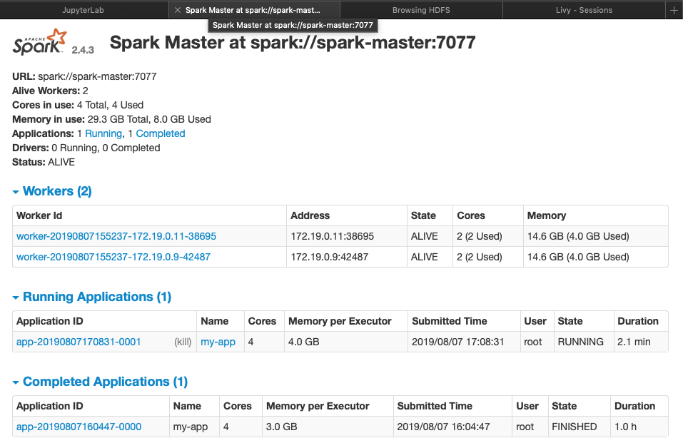
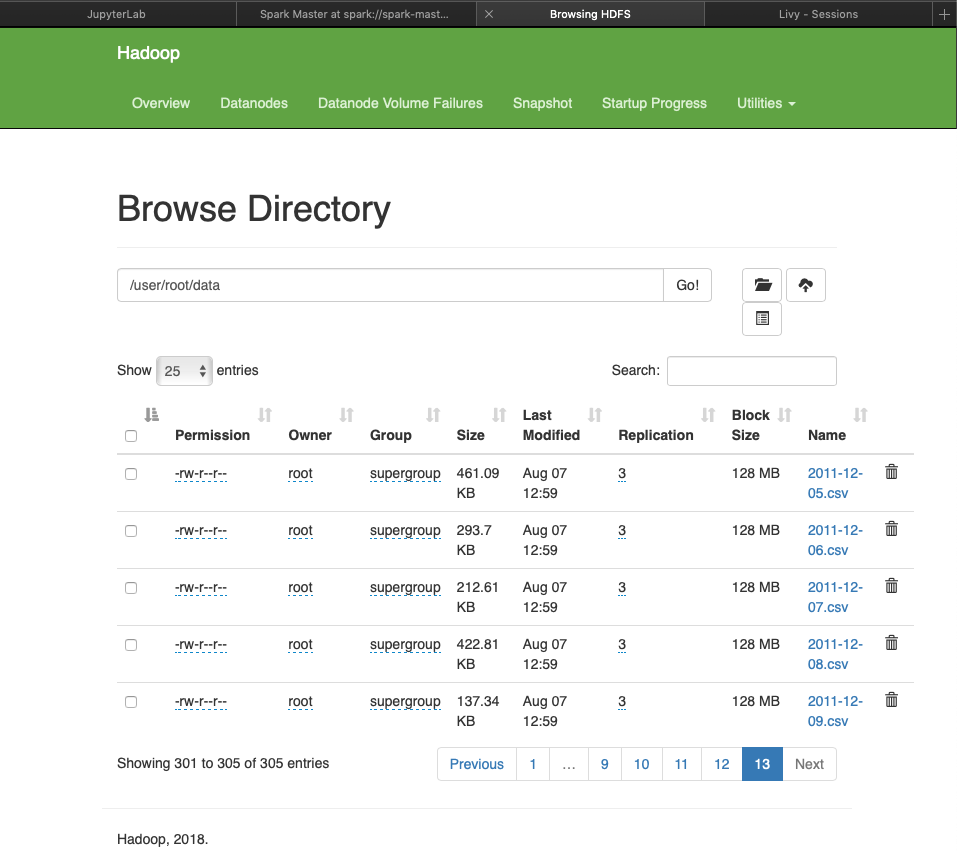

### This project provides a stand-alone spark cluster with hadoop storage; jupyterlab notebook server. The following projects/blogs were used to create this project:
* https://github.com/big-data-europe/docker-hadoop
* https://github.com/databricks/Spark-The-Definitive-Guide
* https://towardsdatascience.com/a-journey-into-big-data-with-apache-spark-part-1-5dfcc2bccdd2

### Docker
* Clone this repo and then:
    docker-compose up --scale spark-worker=2 -d
    (the optional scale switch creates two spark workers)

### Hadoop
* Get a shell inside the hadoop namenode instance:
    docker exec -it namenode /bin/bash
* Create a hdfs directory and upload data by:
    hdfs dfs -mkdir -p data
* Load local csv files (user docker cp to move host files to container):
    hdfs dfs -put ./*.csv /user/root/data

### Jupyter
* Access the jupyter notebook at http://localhost:8888

### Service URLs
* Hadoop: http://localhost:9670
* Spark: http://localhost:8080

